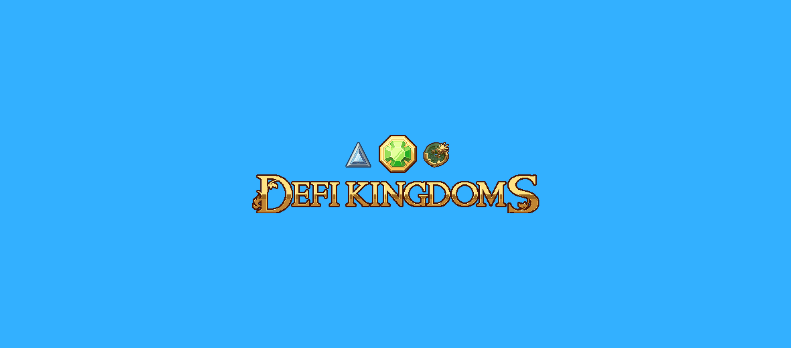

import Card from "@site/src/components/Card/Card"
import { Grid, Text } from "@mantine/core"
import SectionCTA from "@site/src/components/SectionCTA/SectionCTA"

## DeFi Kingdom's Success Story with Grove

## The Challenge

### Visionary Ambitions

DFK aspired to create a "fully-fledged MMORPG built on a robust cross-chain DeFi protocol." To realize this vision, they required a swift and cost-effective RPC node solution.

<!-- truncate -->

### RPC Hurdles

DFK's journey towards their goal was riddled with RPC service challenges. The overwhelming traffic from DFK often led to RPC service lags or even crashes, culminating in a subpar user experience.

### The Need for Reliability

For the DFK team, it became evident that they needed to offer additional, dependable RPC options for their players to ensure a seamless gaming experience.

<Card>

## Why Grove

In the intricate realm of decentralized finance and gaming, DeFi Kingdoms aspired to create an experience that was both immersive and seamless. Their vision of a "fully-fledged MMORPG built on a robust cross-chain DeFi protocol" demanded an infrastructure that was not only fast but also resilient against the unpredictable surges of user traffic. The challenges they faced with traditional RPC services, from lags to outright crashes, highlighted the need for a solution that was both scalable and reliable.

Enter Grove. Grove wasn't just another RPC provider; it represented a paradigm shift in how DeFi Kingdoms approached their infrastructure challenges. With its decentralized nature, Grove offered unparalleled uptime, ensuring that gamers had a smooth experience irrespective of the load. Moreover, Grove's commitment to decentralization aligned perfectly with DeFi Kingdoms' ethos, ensuring that the gaming experience remained true to the principles of blockchain. The ability to swiftly integrate with multiple chains, coupled with cost-efficiency and robust support, made Grove the obvious choice for DeFi Kingdoms. In choosing Grove, DeFi Kingdoms wasn't just selecting an RPC solution; they were partnering with a vision that seamlessly blended the worlds of gaming and decentralized finance.

</Card>

## The Solution

### Decentralization for Stability

By offering a decentralized RPC option through Grove, DFK can sidestep the centralized outages that often disrupt traditional gaming, ensuring players enjoy a smooth and uninterrupted gaming experience.

### Gaming Without Interruptions

Grove, renowned for its unmatched reliability at scale, ensures that gamers can indulge in their passion without disruptions.

### Enhancing User Experience

To elevate the gaming experience for DFK users, DFK introduced Grove as the recommended decentralized node solution for its DFKchain subnet. This collaboration also facilitated DFK Serendale's transition from Harmony to Klaytn. Over time, Grove's RPC service has emerged as the preferred choice for players on both DFKchain and Klaytn.

<SectionCTA />