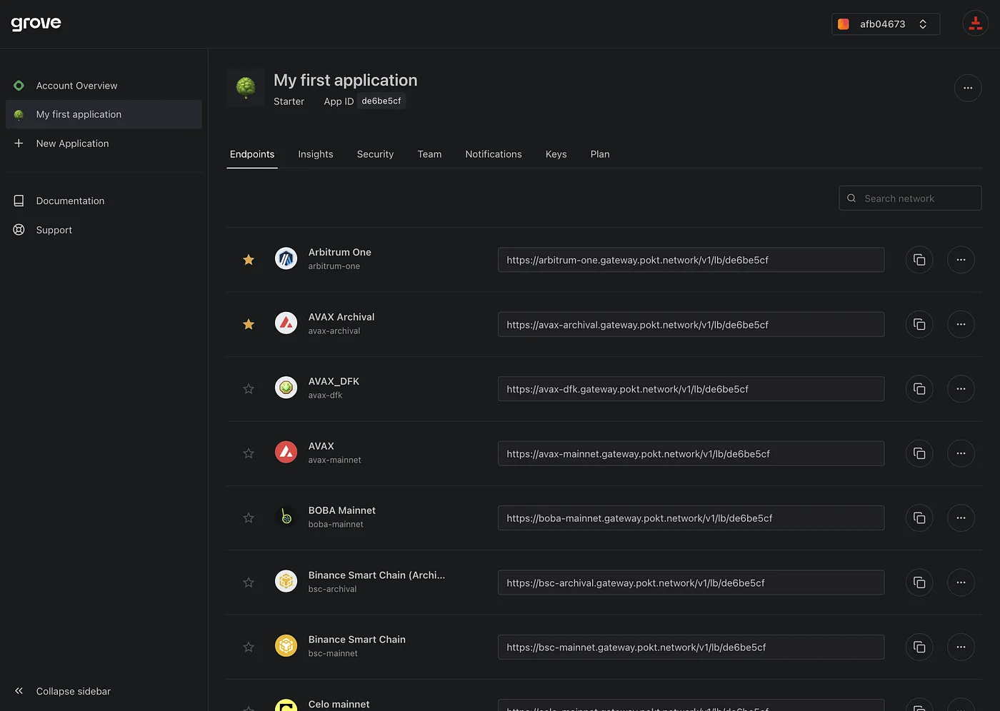

Today we are excited to announce the first phase of Grove’s new [Portal](https://portal.grove.city/) design. This redesign project has been long awaited and we are so excited to finally share it with you. The goal is to do more than change the look of the Portal. We now have a foundation that enables us to provide the highest quality data, empower new gateways and build features that will allow our users to customize their stack with little complication.

<!-- truncate -->

## What’s new?

### Sidebar Navigation.

Easily find your account’s apps, docs and support. The appmojis make it easy to choose the right app even when the menu is collapsed.

### Better data, front and center.

As soon as you log into your account, you will be able to quickly assess the health of your apps with the following metrics over 7, 30, 60 or 90 days.

- Total Relays
- Average Latency
- Success Rate
- Number of Errors

### Favorite chains.

We believe that multi-chain apps are the path forward in web3. Each application has access to all 40+ chains we support at no additional cost. If you have a few chains you work with all the time or would like to try, select the star to favorite the chain. This will bring it to the top of your list for easy access.

## Coming Soon

### Error Logs.

Users will have a new and better way to view the error logs for their application. Some example data points include: timestamp, method and error code. This will make it much easier to monitor the health of an app and to troubleshoot quickly.

### Custom notifications & relay limits.

Bear market = bare budget. Users on Pay as you Go (PAYG) plans will be able to set custom notifications to alert them if traffic is projected to pass a certain threshold. This helps users create a more predictable budget and stay on track. If notifications aren’t enough, users will also be able to set custom relay limits to stop traffic from exceeding the defined threshold. This will help users control the traffic in their apps and limit overspending.

### Account level billing.

We are restructuring billing to make your life simpler. Instead of managing invoices per application, users will only need to manage billing at the account level. This allows users to structure their apps as they see fit without having to manage multiple invoices at once. Each account will receive one invoice each month with the apps as line items within the total.

You’re going to start seeing lots of new changes — we want to hear from you! Join us on [Discord](https://discord.gg/build-with-grove) to share your feedback, request new features or new chains.

Let’s Grove!!
