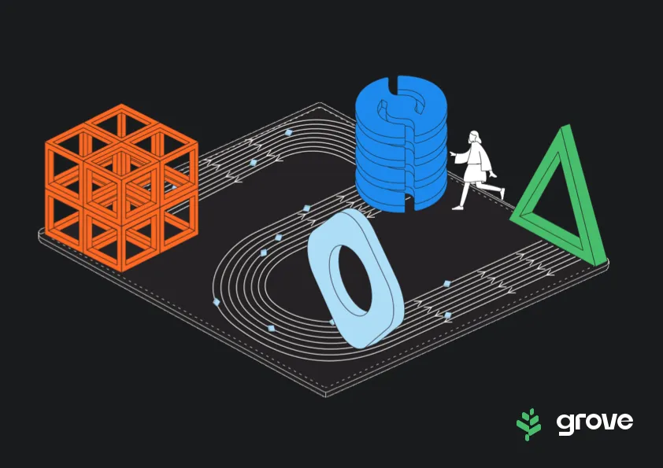

Until today, there was Pocket Network Inc. (PNI), Pocket Network Foundation (PNF), Pocket DAO, and of course, the Pocket Network protocol. This has no doubt been confusing for everyone in the ecosystem.

Today, we’ve rebranded Pocket Network Inc. to Grove.

<!-- truncate -->

The PNI team has built out the network’s first gateway, the Portal. As we begin to see new gateways come online, the distinction between the Pocket Network protocol, and the Pocket Network Portal, becomes increasingly important.

We are excited to celebrate the evolution of Pocket Network and looking forward to sharing our future as Grove.

Grove is a place where web3 developers can build in the shade, without the distractions of web2 technology or tradeoffs of using web3 infrastructure. Historically, it has been incredibly difficult for web3 developers to access reliable, performant and cost-effective infrastructure. Grove is the first web3 native company on the Pocket Network protocol to finally solve this problem. Even though we changed our name, we’re still the same company at heart.

The RPC service should remain uninterrupted during this time. However, please expect the following changes in the coming weeks:

The number of daily free relays will be reduced from 250k to 100k. This impacts all “Always Free” and “Pay as you go” plan holders. Effective immediately.
“Always Free” tier will have a throughput limit of 30 rps. Effective immediately.
A fresh new UI with improved data.
Please spread the news by amplifying on Twitter/X: [https://twitter.com/BuildWithGrove/status/1703849584986927531](https://twitter.com/BuildWithGrove/status/1703849584986927531)

We are looking forward to growing with you.

Let’s Grove!!
