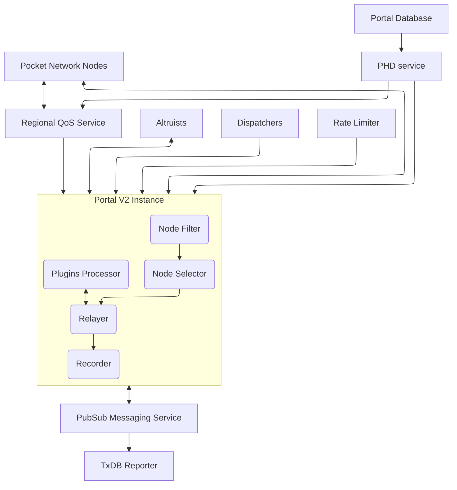

# Architecture

```mermaid
%%{init: {"flowchart": {"defaultRenderer": "elk"}} }%%

flowchart
    subgraph pi1 [Portal V2 Instance]
    nodeFilter(Node Filter)
    nodeSelector(Node Selector)
    plugins(Plugins Processor)
    relayer(Relayer)
    recorder(Recorder)

    nodeFilter-->nodeSelector
    nodeSelector-->relayer
    plugins<-->relayer
    relayer-->recorder
    end

    nodes<-->pi1
    rqos-->pi1
    pi1<-->pubsub
    altruists<-->pi1
    phd-->rqos
    phd-->pi1
    dispatchers-->pi1
    rateLimiter-->pi1

    nodes[Pocket Network Nodes]
    altruists[Altruists]
    dispatchers[Dispatchers]
    postgres[Portal Database]
    phd[PHD service]
    pubsub[PubSub Messaging Service]
    txdbReporter[TxDB Reporter]
    rqos[Regional QoS Service]
    rateLimiter[Rate Limiter]

    postgres-->phd
    pubsub-->txdbReporter
    nodes<-->rqos

```
